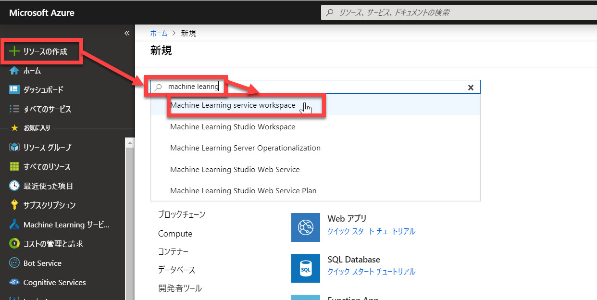
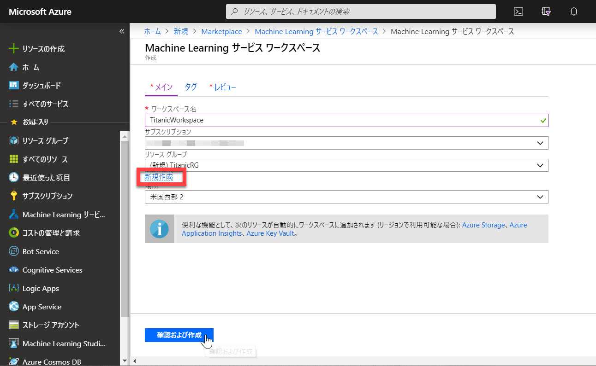
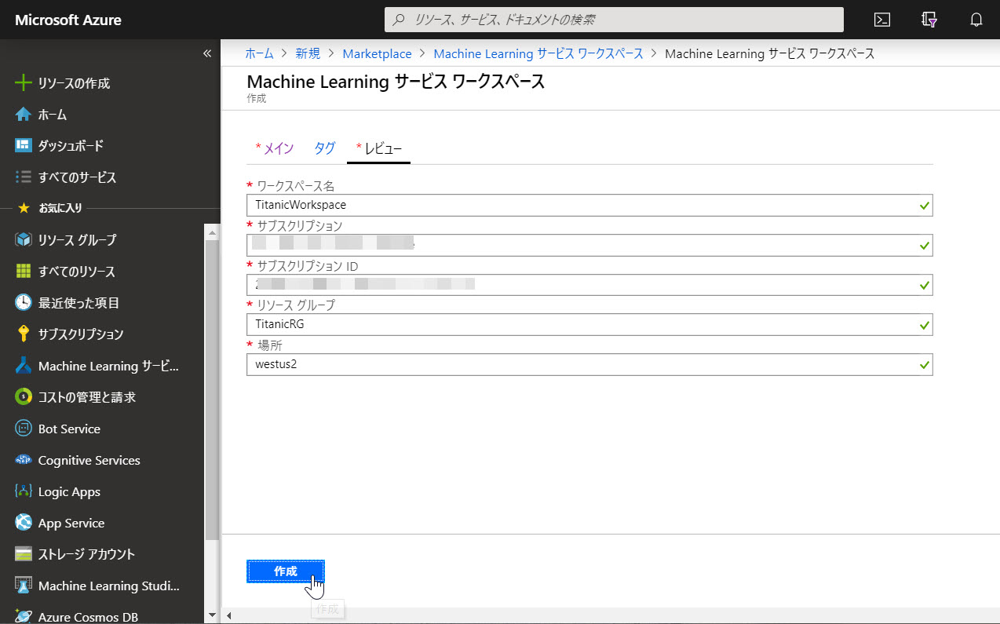
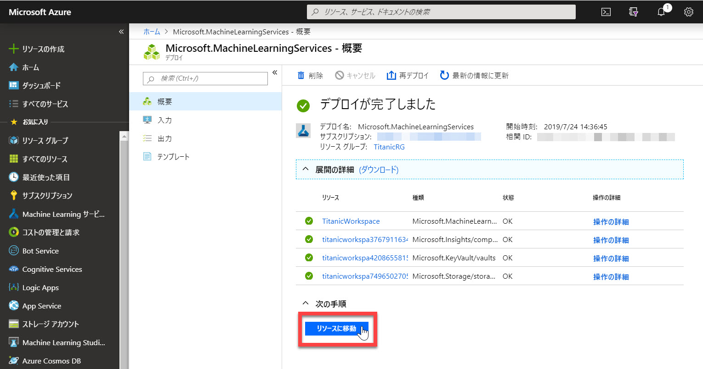
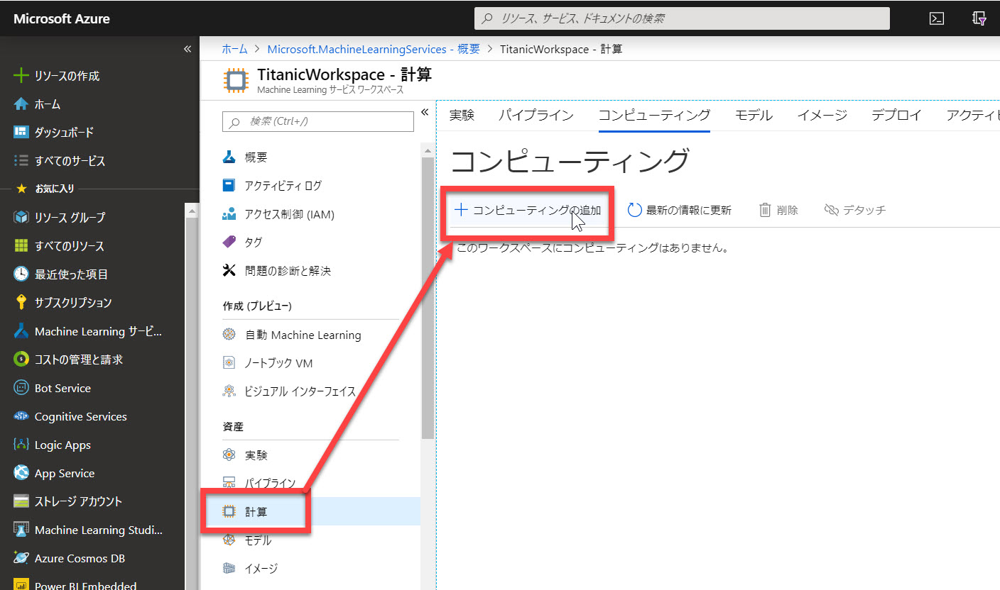
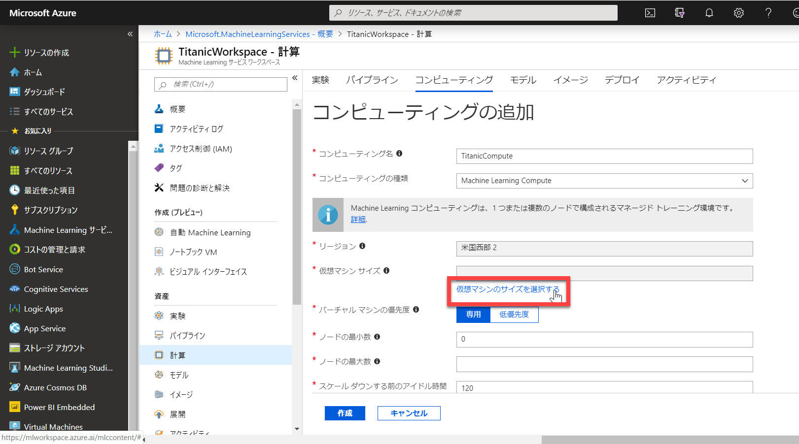
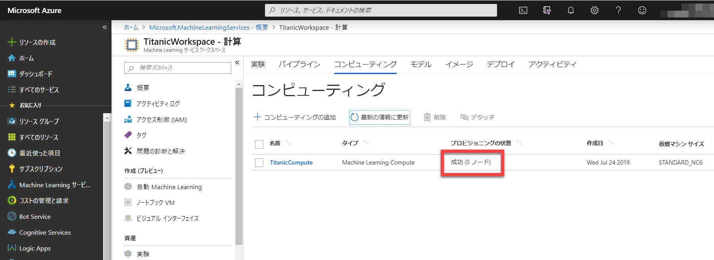

# Workspace と Compute を作成する

[前のステップ](./01_preparedata.md) で、学習に使用するデータセットを用意しました。

このステップでは、

- 学習のコンテキストである **Workspace**
- 学習の実行主体である **Compute**

を作成して、学習の準備をします。

Azure Machine Learning Service で学習の実行や学習後のサービスの管理を行う環境を **Workspace** と呼びます。
また、学習に使用する仮想マシンのクラスターを **Compute** (ポータルやドキュメントでは "**計算**" と日本語訳されているかもしれません)

---

## Workspace の作成

最初に Machine Learning Service の Workspace を作成します。

1. [Azure ポータル](https://portal.azure.com) で、[**リソースの作成**] を選択して検索ボックスに "**machine learning**" と入力します。
2. 検索結果で "**Machine Learning service workspace**" を選択します。  
   

3. "Machine Learning サービス ワークスペース" で [作成] をクリックします。
4. 以下の内容を入力・選択して、[確認および作成] をクリックします。

   |項目名|値|
   |---|---|---|
   |ワークスペース名|任意 (ここでは "TitanicWorkspace") |
   |サブスクリプション|お持ちのサブスクリプション|
   |リソースグループ|[**新規作成**] して任意の値 (ここでは "TitanicRG")|
   |場所|任意 (ここでは "米国西部2")|

   

5. 入力内容を確認して、[**作成**] をクリックします。  
   

6. 少し待って "**デプロイが完了しました**" と表示されたら、[**リソースに移動**] をクリックします。
   

以上で、Workspace ができました。

---

## Compute の作成

続いて Compute を作成します。
Compute とは学習で使う仮想マシンのクラスター構成のことです。ポータルでは "計算" と訳されています。

> この後の手順で Experiment を作成する際に Compute を一緒に作成することもできます。
> ただしその場合は、低優先度 VM (優先度が高いタスクに割り込まれる可能性があるが、その代わり  非常に安い) を選択することができません。
> 以下では、課金を抑えるために低優先度 VM を使います。

1. Workspace のブレードで [**計算**] をクリックします。
   

2. 以下の入力・選択をします。

   |項目名|値|補足|
   |---|---|---|
   |コンピューティング名|任意 (ここでは "TitanicCompute") | |
   |コンピューティングの種類|Machine Learning Compute| |
   |リージョン|デフォルトのまま| |
   |仮想マシンサイズ|[**仮想マシンのサイズを選択する**] で選択|選択可能ならば "**Standard_NC6**" など GPU ありのマシン。ただし今回のコンテンツでは "**Standard_D2_v2**" などの GPU なしでも特に問題ありません|
   |バーチャルマシンの優先度|低優先度| |
   |ノードの最小数| 0 |ノードの初期化などの時間をかけたくない場合は 1 にします。ただしその場合は、終了後に Compute を必ずシャットダウンしてください。|
   |ノードの最大数| 4 |それ以上でも設定可能だが、今回のコンテンツでは 4 で充分|
   |スケールダウンする前のアイドル時間|120|デフォルトのまま|

   

   > **ノードの最小数** を 0 にすると、学習のイテレーションを開始する際にノード (それぞれの仮想マシン) の作成や初期化に時間がかかります。
   > 集合形式でのハンズオンなどで利用する場合は 1 にすることで待ち時間を短縮できます。ただし、その場合は、このコンテンツの **終了時** に Compute をシャットダウンするか、**リソースグループごと削除** してください。忘れると課金され続けます。  
   >
   > 最小数を 1 にすることで、データソースの **プロファイリング** ができるというメリットもあります。これについては、次のステップで改めて説明します。

3. [**作成**] をクリックします。Compute の [プロビジョニングの状態] が "成功" になれば Compute が完成です。
   

---

Workspace と Compute が完成しました。

[次のステップ](./03_runexperiment.md) では、いよいよ **学習** を実行します。
