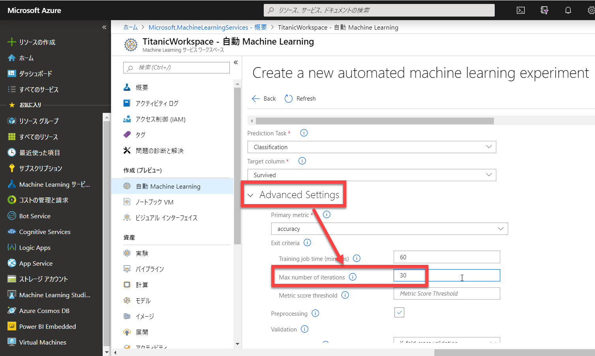
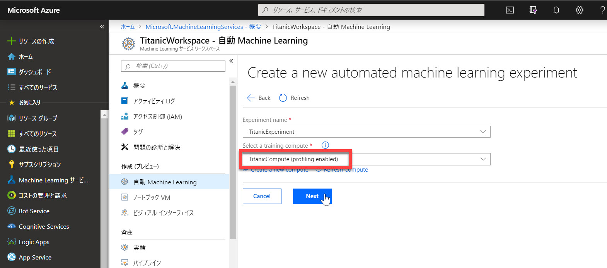

# 学習する

前のステップで、[学習の準備](./02_createworkspace.md) が完了しました。

このステップでは、

- 学習の単位となる Experiment を作成
- 学習を実行
- もっとも精度が高い学習モデルを自動的に決定
  
します。

> このステップの最後の操作で学習を開始した後に **10～20分程度の待ち時間** が発生します。  
> 休憩などはこのステップを実施した後をおすすめします。

---

## Experiment の作成

学習の単位となる Experiment を作成します。

1. [**自動 Machine Learning**] を選択して、[**Create experiment**] をクリックします。  
   

2. 以下の内容を入力・選択します。続いて [**Next**] をクリックします。

   |項目名|値|
   |---|---|
   |Experiment name|任意（ここでは "TitanicExperiment"）|
   |Select a training compute|前のステップで作成した Compute|

   

3. ストレージが作成されて [**Upload**] ボタンが表示されたらクリックします。  
   [最初のステップ](./01_preparedata.md) で Kaggle からダウンロードした "train.csv" をアップロードします。
   

4. アップロードに成功するとデータソース一覧に表示されるので、"train.csv" をクリックします。
   

5. データソースのプレビュー画面が表示されます。
6. 今回の学習対象から外すカラム（説明変数と言います）に含めない列を "Ignored" にします。  
   （デフォルトでは全てのカラムが "Included" になっているはずです）

   "Ignored" にするのは以下のカラムです。

   - PASSENGERID
   - SURVIVED
   - NAME
   - TICKET
   - CABIN
   - EMBARKED

   

   > 学習対象としない列をどのように決めるかは、[**こちら**](https://github.com/seosoft/Titanic_MLNet/blob/master/02_dataanalyze.md) などを参考にしてください。
   > このコンテンツでは、データの分析の手順は省略しました。

7. **Task** の種類と **予測対象** のカラムを選択します。続いて [Start] ボタンをクリックします。自動的に学習が始まります。

   |項目名|値|
   |---|---|
   |Prediction Task|Classification|
   |Target column|Survived|

   

   > 集合形式でのハンズオンなどで利用する場合は、[**Start**] ボタンをクリックする前に、以下の手順でイテレーション数を減らして学習の時間を短縮することができます。
   >
   > 1. [**Advanced Settings**] をクリックします。
   > 2. [**Max number of iterations**] を例えば 30 などの小さい値にします。（デフォルトは 100）
   > 3. [Start] ボタンで学習を始めます。
   >
   > 

8. "Run Detail" 画面に自動的に遷移します。  
   この後、学習が終了するまでに **10～20分程度** かかります。（休憩などは、このタイミングでどうぞ）

   

9. 学習が終了すると "**Run is Completed**" と表示されます。  
    もっとも Accuracy (精度) が高かったイテレーションが自動的に選択されています。

   

   > 特定の理由がある場合は（例えば、Accuracy ではなく Recall のスコアが高いモデルを採用したい場合など）、任意のイテレーションを選択して以降の手順を実施することができます。
   >
   > 

以上で、学習が終了し、一番精度が高いモデルが自動的に選択されました。

---

## 補足：データセットのプロファイリング

※プロファイリングは、このコンテンツでは必須の手順ではありません。

[前のステップ](./02_createworkspace.md) で Compute を作成した際には、**ノードの最小数** を **0** にしました。

これは、学習の Experiment が終了した後で **ノードを自動的にシャットダウン** して余計な課金を防ぐための設定です。

それに対して、ノードの最小数に **1 を指定** するメリットもあります。

- Experiment を実行する前の待ち時間（ノードの初期化など）を最小化することができます
- データセットのプロファイリングが可能になります

待ち時間の最小化は、数分が惜しいほど急いでいる場合（集合形式でのハンズオンなど）意外には、1 にする必要性はあまりないかもしれません。

データセットのプロファイリングは、プロジェクト初期を含めて、データセットの分析を行う際には有用な機能です。

> ただし、他のツールを使ってデータセットを分析してから学習させてもいいので、Automated ML の中で絶対に実施しなければならない、というものでもありません。

Automated ML の環境中でプロファイリングするには、以下の手順で操作します。

1. "**Compute**" の設定画面で、[**ノードの最小数**] を **1** にして、[**更新**] をクリックします。  
   

   > Compute の新規作成の際に、最小数を 1 にして作成してもかまいません。

2. この状態で、Experiment を作成すると、[**Select a training compute**] に表示される Compute 名の末尾に "**(profiling enabled)**" と付いたものが表示されます。  
   これを選択して Experiment を作成します。

   

---

アルゴリズムや条件を変えながら繰り返し学習を実行して、もっとも成績がよいモデルを探す苦労から解放されることが分かったと思います。

次のステップでは、予測サービスの [**Docker イメージ** を作成して、Azure 上に **デプロイ**](./04_createimage_deploy.md) します。
