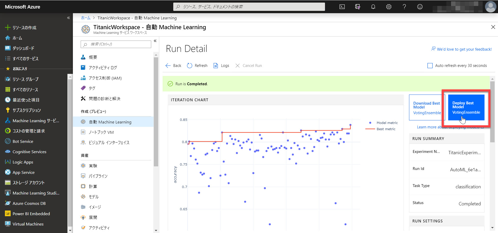
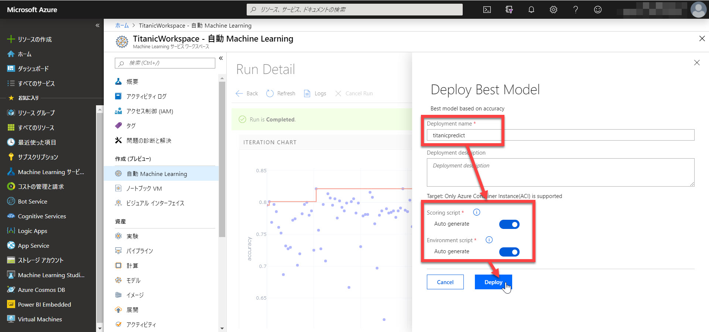
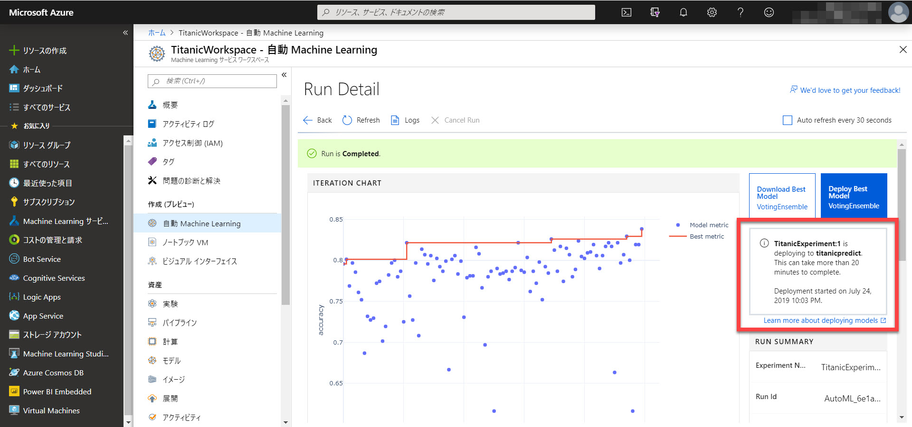
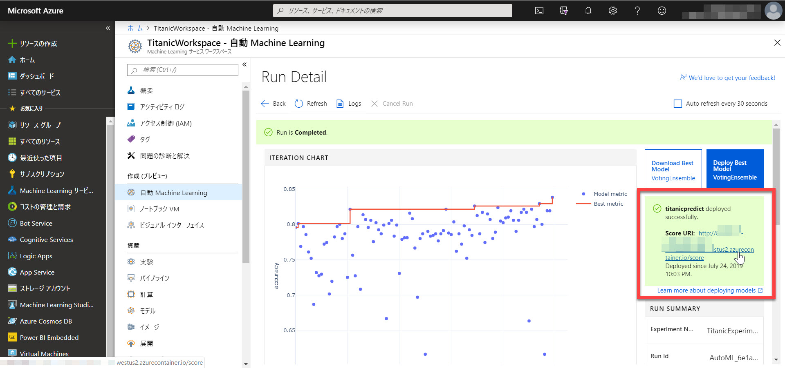
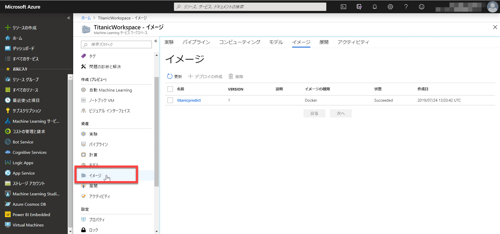
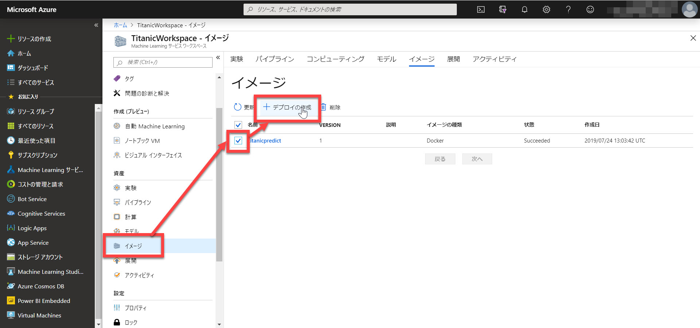
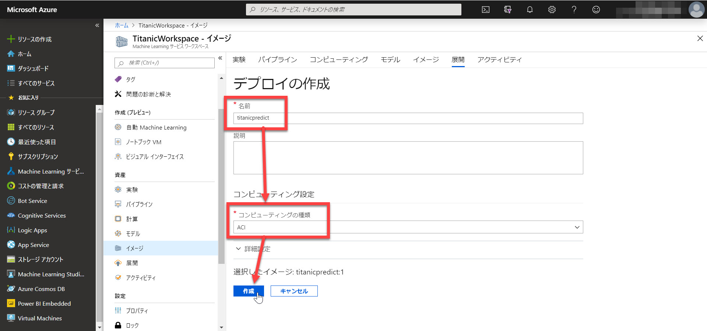
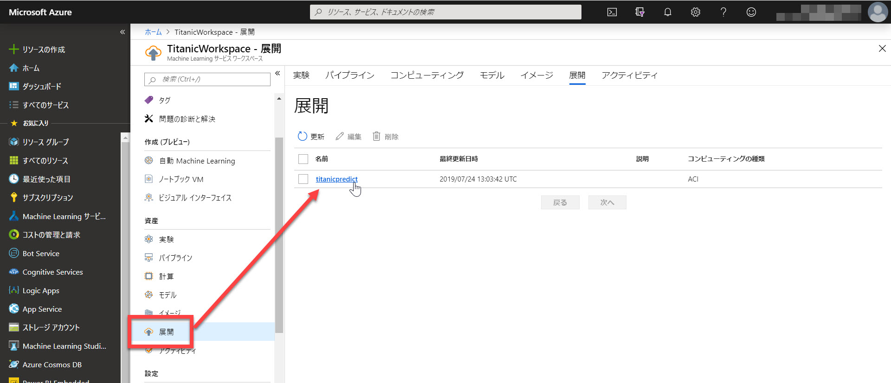

# イメージの作成と展開

前のステップで、学習が終了し、[もっとも精度が高いモデル](./03_runexperiment.md) が決まりました。

このステップでは、

- 学習モデルから Docker イメージを作成
- Docker イメージをデプロイ

します。

> このステップで、Docker イメージ作成を始めた後に **10～20分程度の待ち時間** が発生します。
> 時間の都合によっては、その手順を実施した後で中断してもかまいません。イメージの作成はクラウド上で実行されます。
>
> なお中断する場合は、作成した **Compute の最小数を 0** にすることを
> 必ず実施してください。

---

## 学習モデルから Docker イメージを作成

前のステップで決定した一番精度が高いモデルから、デプロイ用の Docker イメージを作成ます。

1. Experiment 画面で [Deploy Best Model] をクリックします。
   

2. "Deploy Best Model" 画面で以下の入力・選択をします。続いて [**Deploy**] ボタンをクリックします

   |項目名|値|
   |---|---|
   |Deployment name|任意（ここでは "titanicpredict"）|
   |Scoring Script Auto generate|True (デフォルトのまま)|
   |Environment Script Auto generate|True (デフォルトのまま)|

   

3. "Run Detail" 画面に、イメージ作成中であるメッセージが自動的に表示されます。  
   この後、イメージの作成が終了するまでに **10～20分程度** かかります。  
   （一旦中断する場合はここでどうぞ。Compute の最小数を 0 にすることをお忘れなく）

   

4. "<イメージ名> **deployed successfully**" というメッセージが表示されれば、Docker イメージの作成は成功です。
   

5. [**イメージ**] を選択すると、作成されたイメージが表示されます。  
   

---

## Docker イメージをデプロイ

デプロイ対象のイメージができたので、実際にデプロイしてサービスを公開します。

1. [**イメージ**] で、作成したものを**選択**（チェック）して [**デプロイの作成**] をクリックします。
   

2. 以下の入力・選択をします。続いて [**作成**] をクリックします。

   |項目名|値|
   |---|---|
   |名前|任意（ここでは "titanicpredict"）|
   |コンピューティングの種類|ACI|

   

   > コンピューティングの種類で "**AKS**" を選択すると、柔軟なデプロイができます。今回は設定が簡単な "ACI" を選択します。

3. 少し待つと、デプロイが完了します。  
   [**展開**] を選択すると、成功したデプロイが表示されます。  
   

以上で、学習モデルを Web サービス化して公開することができました。

---

次のステップでは、公開した [Web サービスを実際に呼び出し](./05_requestservice.md) てみます。
