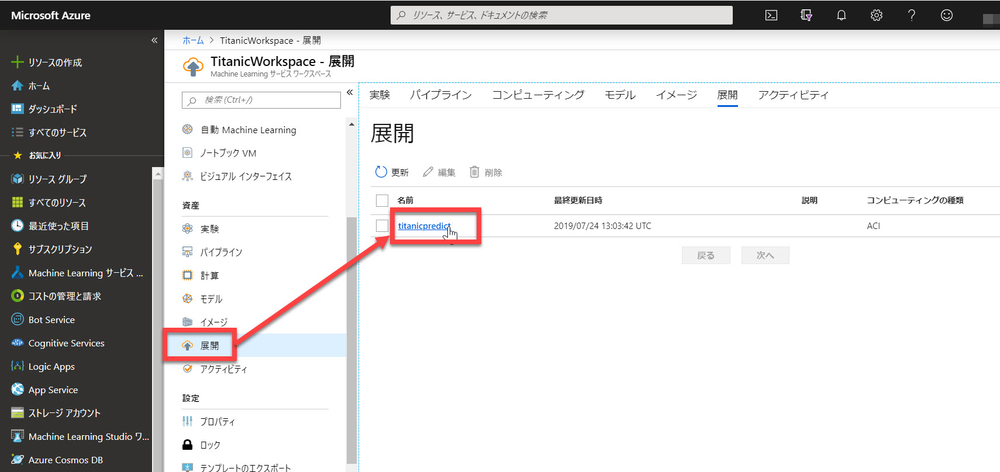
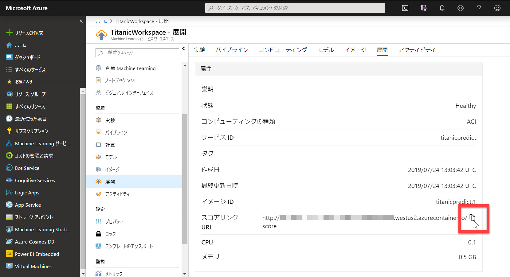
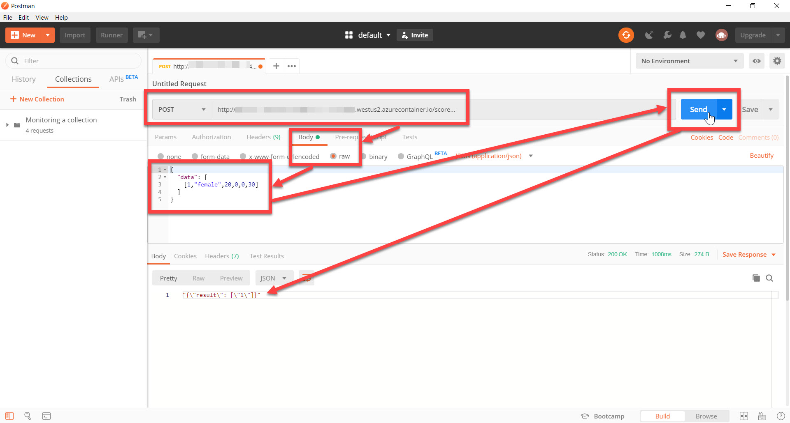

# 展開したサービスを利用する

前のステップで、学習済みモデルを [Docker イメージに組み込んで、Web サービスとしてデプロイ](./04_createimage_deploy.md) しました。

このステップでは、コンテンツの最後として、発行した Web サービスをクライアントから呼び出してみます。  

以下では、[**Postman**](https://www.getpostman.com/downloads/) をクライアントとして使用します。

> このステップの最後では、Azure のリソースグループの削除についても触れています。
> このコンテンツでは、設定によっては GPU ありの仮想マシンを常時起動の状態で動作させている

---

## サービスの URL を確認

デプロイされた Web サービスのエンドポイントを確認します。

1. Azure ポータルの **"Workspace" ブレード** で [**展開**] を選択し、デプロイの名前（ここでは "**titanicpredict**"）をクリックします。  
   

2. "詳細" ブレードが表示されるので、[**スコアリング URI**] を取得します。  
   

---

## Postman からリクエスト

1. まだ持っていない場合は、[**Postman**](https://www.getpostman.com/downloads/) をダウンロード、インストールします。

2. Postman で以下の情報を埋めていきます。  
  
   |区分|項目|値|
   |---|---|---|
   |リクエスト|メソッド|POST|
   |リクエスト|URL|前の手順で確認した **スコアリング URI**|
   |Headers|Content-Type|application/json|
   |Body|("Raw" に切り替えて)|以下の内容、または一部の値を変更したもの|

   ```json
   {
     "data": [
       [1,"female",20,0,0,30]
     ]
   }
   ```

3. [**Send**] をクリックします。入力が正しければ応答が返ってきます。  
   **result** の値が予測した値です。
   1 ならば助かる、0　ならば助からないと予測しています。
   

---

## コンテンツの最後に

このコンテンツは Azure のリソースを使っています。  
設定や操作によっては、継続して課金される可能性があります。

必要に応じて、以下のどちらかを必ず実行してから、作業を終わってください。

- 仮想マシンのシャットダウン
- リソースグループの削除

---

### 仮想マシンのシャットダウン

学習用に作成した **Compute** で、ノードの最小数を 0 以外にしている場合は、仮想マシンが起動し続けます。

課金の単位が大きいので、コンテンツの終了時には忘れずに **最小数を 0** にしてください。  
最大でも 120 秒ですべてのノード（仮想マシン）がシャットダウンして、リソースが解放されます。

この操作を行っても、仮想マシン以外のリソースは継続して課金されます。  
ただし仮想マシンに比べるとそれ以外の課金額は小さいので、

- コンテンツを中断したので後で続きをやりたい場合
- 間を置かずに復習する場合

などには仮想マシンのシャットダウンだけでも構わないかもしれません.

不安な場合は、リソースグループの削除をおすすめします。

---

### リソースグループの削除

ハンズオンのコンテンツをすべて終了して、作成したリソースが不要になったら、Azure ポータルで今回作成した **リソースグループを削除** してください。

リソースグループを削除すると、今回のコンテンツに関する課金はすべて止まります。

---

以上で、このコンテンツはすべて終了です。

機械学習の深い知識は不要ですが、非常に少ない手順で機械学習できることが分かったと思います。  

このコンテンツへの意見、改善の提案などは、このリポジトリの Issue, Pull request でお知らせください。
