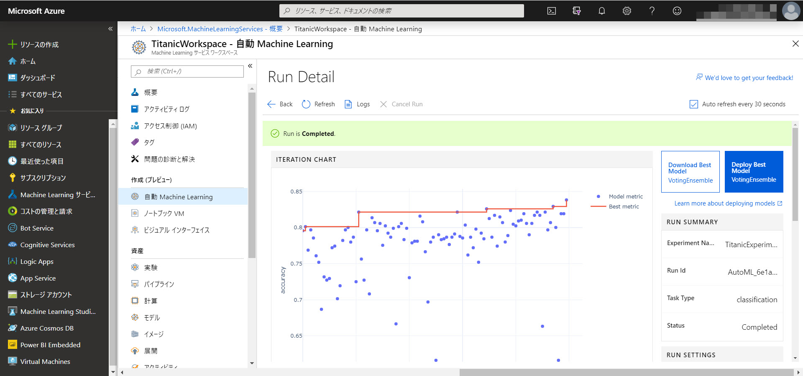

# Automated ML で二項分類 ～ タイタニック号から脱出できるか？

このコンテンツでは、Azure Machine Learning Service の [**Automated Machin Learning**](https://docs.microsoft.com/ja-jp/dotnet/machine-learning/) (autoML と言うこともあります) を使って 二項分類 を行う手順を紹介します。

Automated ML を使用するメリットは、複数の Experiment (学習の実行単位) を自動的に実行して、**もっとも精度が高い学習モデルを決定** できることです。

このコンテンツのテーマは、**タイタニック号の乗船リスト** から、どのような属性の人が **"助かる" かを予測** することです。

学習からサービスの公開まで、すべての操作を Azure ポータルの [**Machine Learning Service Workspace**](https://docs.microsoft.com/ja-jp/azure/machine-learning/service/) で行います。
Workspace は機械学習プロジェクトのすべてのステップを管理できるものです。

> 同様の分類モデルを作成する手順として、
>
> - [**Azure Machine Learning Studio** を使用するコンテンツ](https://github.com/seosoft/Titanic_MachineLearningStudio)
> - [**Azure Machine Learning Service Visual interface** を使用するコンテンツ](https://github.com/seosoft/Titanic_MLServiceVisualInterface)
> - [**ML.NET** を使用するコンテンツ](https://github.com/seosoft/Titanic_MLNet)
> - [**ML.NET Model Builder** を使用するコンテンツ](https://github.com/seosoft/Titanic_MLNetModelBuilder)
>
> を用意しています。  

---

今回は、データセットを **学習** するだけではなく、学習済みモデルを **ACI** (Azure Container Instances) で **サービス化** してクライアントから利用する手順まで紹介します。

> このコンテンツの実施には、Azure サブスクリプション（[**無償評価版**](https://azure.microsoft.com/ja-jp/free/) でも可）が必要です。

機械学習は、以下の流れで進めます。

1. [データを用意する](./01_preparedata.md)
2. [Workspace と Compute を作成する](02_createworkspace.md)
3. [学習する](./03_runexperiment.md)
4. [イメージの作成と展開](./04_createimage_deploy.md)
5. [展開したサービスを利用する](./05_requestservice.md)

> このコンテンツは、**10～20分の待ち時間** が数回発生します。
>
> このため、集合形式でのハンズオン実施などでは、できるだけ待ち時間を短くする、待ち時間のタイミングを休憩時間にする、などの工夫が必要になるかもしれません。
>
> - Compute (＝学習で使う仮想マシン) を、コンテンツの最後まで起動したままにする。この場合は、コンテンツ終了後に確実にリソースグループを削除して、課金が継続されないようにしてください。
> - Experiment (学習の単位) の回数を少なくして、すべての学習が完了するまでの時間を短縮する。
> - 集合形式では、学習から Docker イメージの作成までの手順を行う。サービス化は必要に応じて各自で行う。
>
> このコンテンツは、できるだけ課金が少なくなるように、特にコンテンツ終了後に余計な課金が継続しない手順で進めています。  
> 時間短縮の方法はコンテンツ中に補足として随時記述します。

---

間違いや更新の提案は、Issue、Pull Request でお知らせください。
